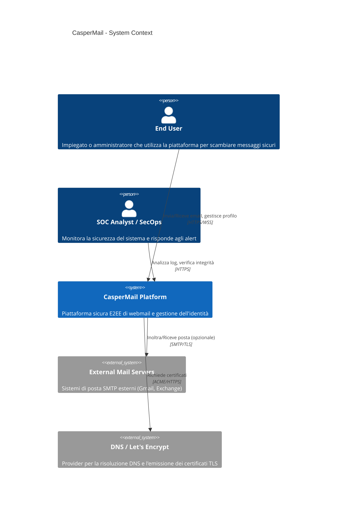
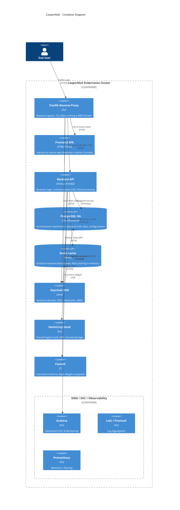
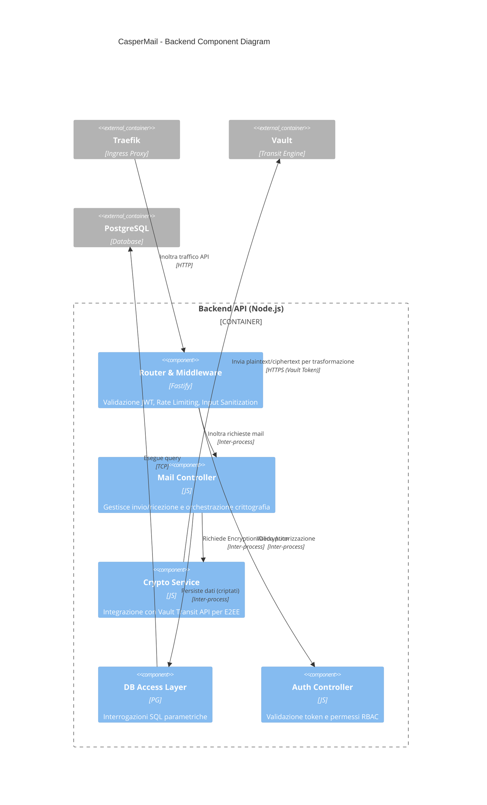
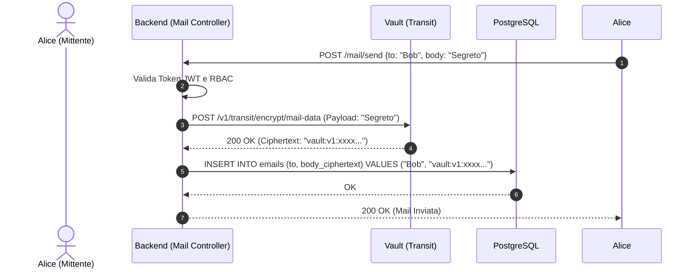

# Documento 2 – Product Architecture

Questo documento descrive l'architettura tecnica ad alto livello di CasperMail, illustrando i vari strati infrastrutturali, logici e applicativi mediante il modello C4 (Context, Container, Component) e diagrammi UML.

## 1. System Context Diagram (C4 - Livello 1)
Il diagramma di contesto illustra come gli utenti interagiscono con CasperMail e quali sistemi esterni sono coinvolti (sebbene l'obiettivo di CasperMail sia minimizzare le dipendenze esterne a favore dell'on-premise).

## 2. Container Diagram (C4 - Livello 2)
Il diagramma dei container esplode la `CasperMail Platform` nei suoi container principali.

## 3. Component Diagram: Backend (C4 - Livello 3)
Focalizziamo l'attenzione sull'architettura interna del `Backend API`, che è il nucleo della logica sicura.

## 4. Flusso di invio Mail Sicuro (UML Sequence Diagram)
Questo diagramma UML illustra come il backend garantisce l'assenza di dati in chiaro a riposo (Zero Knowledge).

## 5. Dettagli Architetturali

### 5.1 Zero Trust Networking
La comunicazione tra i container (es. tra Backend e Vault, o Backend e DB) avviene su una rete overlay (Flannel/Cilium) isolata tramite `NetworkPolicies` strette che permettono solo il traffico esplicitamente dichiarato.
Traefik funge da unico punto di ingresso e termina il traffico TLS proveniente dall'esterno.

### 5.2 Sicurezza Dati (E2EE)
CasperMail adotta un approccio **Encryption as a Service (EaaS)**. Il database PostgreSQL *non contiene mai* il contenuto delle email o i token sensibili in chiaro. Il backend demanda la crittografia a HashiCorp Vault tramite il Transit Engine, assicurando che una compromissione del DB non esponga alcun dato.

### 5.3 Mobile App & MDM Architecture (React Native)
CasperMail include un client enterprise mobile sviluppato in **React Native** (iOS/Android). 
- **Smart Discovery**: L'app implementa un motore di discovery dinamico che, a partire dall'indirizzo email dell'utente, risolve automaticamente l'endpoint del tenant isolato e i metadati OIDC di Keycloak.
- **Hardware Enclave**: Le chiavi private per la decodifica locale dei messaggi (E2EE Client-Side) vengono salvate strettamente all'interno del Secure Enclave / Keystore hardware del dispositivo.
- **Enterprise Distribution**: Le build vengono compilate tramite EAS (Expo Application Services) e distribuite privatamente tramite l'infrastruttura MDM (Mobile Device Management) dell'organizzazione.

### 5.4 Intelligenza (AI) & Security Operations Center (SOC)
I log strutturati generati dai container (Nginx, Node, Vault, Keycloak) vengono prelevati da Promtail e inviati a **Loki**, dove **Grafana** offre dashboard SOC real-time. In futuro, il SIEM potrà integrare un motore AI per l'analisi comportamentale e la rilevazione di anomalie (es. login simultanei da paesi diversi, picchi di richieste errate verso Vault).
