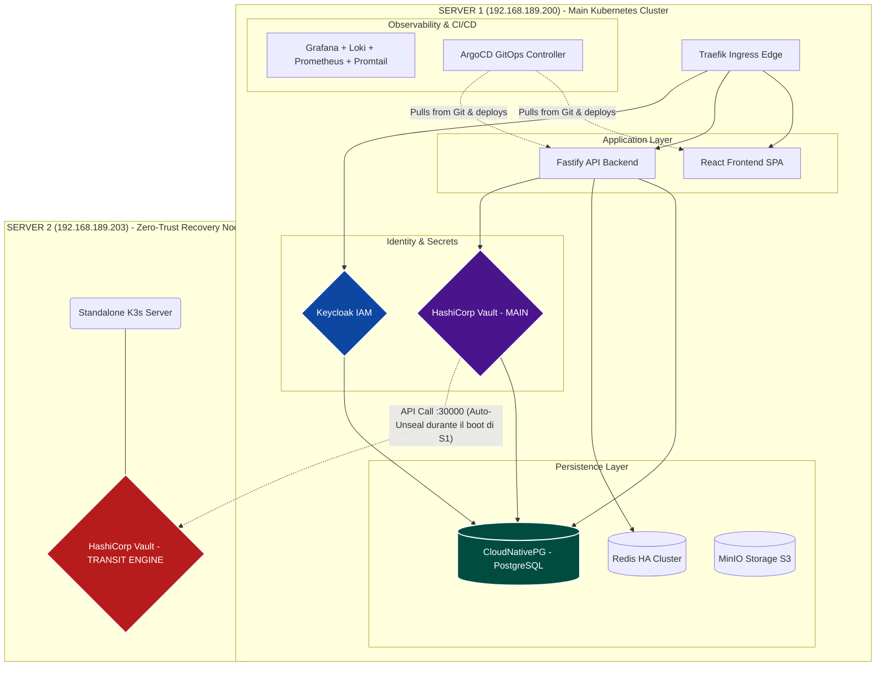

# Mappa Architetturale dei Servizi

Questa mappa mostra la distribuzione fisica dei servizi nei due nodi attualmente implementati.

Come verificato dall'ispezione di sistema, il **Server 2** non utilizza Docker tradizionale né agenti remoti (k3s-agent), ma esegue un cluster Kubernetes indipendente (`k3s.service`) blindato al solo scopo di isolare la cassaforte crittografica e difendere il Server 1 da spegnimenti improvvisi.

### Dettaglio Topologico (Perché servono 2 server?)

Nel mondo Cloud-Native ad altissima sicurezza (Zero-Trust), le chiavi che cifrano il database non sono mai salvate su disco, ma tenute solo in memoria ("Sealed" mode). Quando un server si riavvia (per esempio se va via la corrente o fai un aggiornamento), perde la memoria e il Vault Principale si blocca (Sealing), bloccando di conseguenza anche il Database e i login degli utenti.

**Soluzione adottata:** Abbiamo installato un secondo mini-cluster sul **Server 2** che fa solo una cosa: custodire la chiave *Transit* di sblocco. Quando il Server 1 si riaccende, contatta in modo sicuro il Server 2 sulla porta `30000`, e quest'ultimo gli consegna automaticamente la chiave per "sbloccare" la memoria, facendolo ripartire senza intervento umano.

Per questo l'IP del Server 2 non può mai cambiare.
